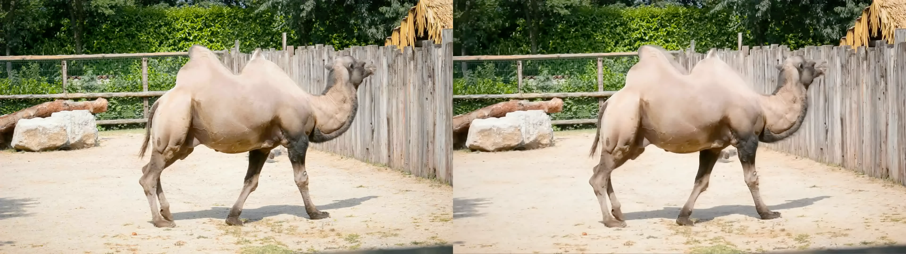
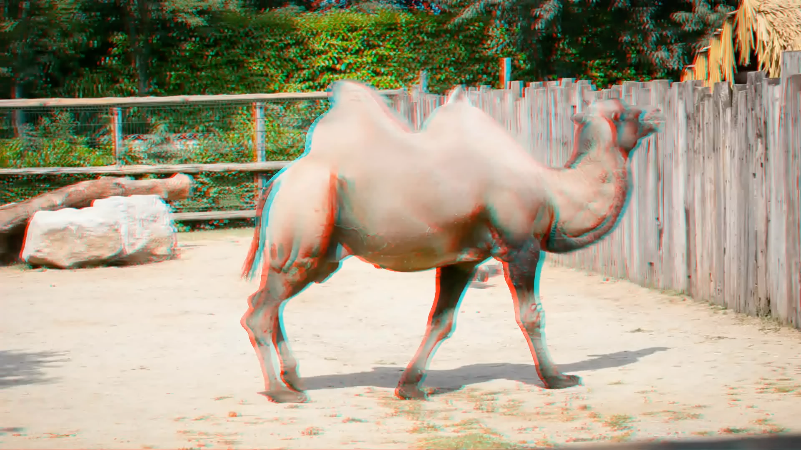

<div align="center">
<h2>StereoCrafter: Diffusion-based Generation of Long and High-fidelity Stereoscopic 3D from Monocular Videos</h2>

Sijie Zhao*&emsp; Wenbo Hu*&emsp; Xiaodong Cun*&emsp; Yong Zhang&dagger;&emsp;
Xiaoyu Li&dagger;&emsp; Zhe Kong&emsp; Xiangjun Gao&emsp; Muyao Niu&emsp; Ying Shan

&emsp;* equal contribution &emsp; &dagger; corresponding author

<h3>Tencent AI Lab &emsp; ARC Lab, Tencent PCG</h3>

<a href="https://arxiv.org/abs/2409.07447">Paper</a> &emsp;
<a href="https://stereocrafter.github.io/">Project page</a> &emsp;
<a href="https://huggingface.co/TencentARC/StereoCrafter2">StereoCrafter2 weights</a>
</div>

This branch packages the upstream StereoCrafter v2 inference code and retains the
original SVD implementation as a selectable backend. The default backend is
`wan_vace`; `svd` remains available for the original StereoCrafter weights.

## Installation

The upstream v2 environment uses Python 3.13 and CUDA 12.8. Install directly from
Git:

```bash
pip install "stereocrafter @ git+https://github.com/samaust/StereoCrafter@v2_python_package"
```

For a local development checkout with demos and test tools:

```bash
git clone --branch v2_python_package https://github.com/samaust/StereoCrafter.git
cd StereoCrafter
pip install -e ".[demo,dev]"
```

DepthCrafter and Forward-Warp are installed as package dependencies; this fork
does not require Git submodules.

## Model backends

| Backend | Base model | Inpainting checkpoint |
| --- | --- | --- |
| `wan_vace` (default) | `Wan-AI/Wan2.1-VACE-14B-diffusers` | `TencentARC/StereoCrafter2` |
| `svd` | `stabilityai/stable-video-diffusion-img2vid-xt-1-1` | `TencentARC/StereoCrafter` |

Model arguments accept either Hugging Face identifiers or local directories.
The default identifiers are downloaded and cached by Hugging Face libraries.

## Inference demos

Generate the depth-splatting input:

```bash
sh run_depth_splatting_inference.sh
```

Run StereoCrafter2 with the default Wan/VACE backend:

```bash
sh run_inpainting_inference.sh
```

The equivalent command is:

```bash
python demo/scripts/inpainting_inference.py \
  --backend wan_vace \
  --base_model Wan-AI/Wan2.1-VACE-14B-diffusers \
  --inpainting_model TencentARC/StereoCrafter2 \
  --input_video_path ./outputs/camel_splatting_results.mp4 \
  --save_dir ./outputs \
  --tile_num 2
```

Select the original implementation with `--backend svd`, the SVD base model,
and `TencentARC/StereoCrafter`. Both backends produce side-by-side and anaglyph
videos. The input is the four-panel video generated by the depth-splatting step.

## Python API

```python
from stereocrafter.inference.inpainting import (
    available_inpainting_backends,
    create_inpainter,
)

print(available_inpainting_backends())
inpainter = create_inpainter()  # defaults to wan_vace
right_frames = inpainter.inpaint(warped_frames, mask_frames)
```

Use the original SVD backend explicitly:

```python
inpainter = create_inpainter(
    "svd",
    base_model="stabilityai/stable-video-diffusion-img2vid-xt-1-1",
    inpainting_model="TencentARC/StereoCrafter",
)
right_frames = inpainter.inpaint(
    warped_frames,
    mask_frames,
    frames_chunk=25,
    overlap=3,
    tile_num=1,
    num_inference_steps=8,
)
```

### Migrating from the python_package branch

The old façade functions have been removed:

```python
# Before
from stereocrafter.inference.inpainting import load_models, tiled_inpaint
pipeline = load_models()
right_frames = tiled_inpaint(warped_frames, mask_frames, pipeline)
```

Migrate to an explicit backend object:

```python
# After
from stereocrafter.inference.inpainting import create_inpainter
inpainter = create_inpainter("svd")
right_frames = inpainter.inpaint(warped_frames, mask_frames)
```

### Adding another backend

A backend factory must return an object with a string `name` and an
`inpaint(frames_warped, frames_mask, **options)` method. Frames use
`[T, H, W, C]` layout and the returned RGB tensor must be float data in
`[0, 1]`.

```python
from stereocrafter.inference.inpainting import register_inpainting_backend

register_inpainting_backend("my_backend", MyInpainter)
```

Applications can then call `create_inpainter("my_backend", ...)`.

## Outputs

The v2 demo generates side-by-side and red/cyan anaglyph videos:





## Acknowledgements

StereoCrafter builds on Stable Video Diffusion, DepthCrafter, Forward-Warp, and
Wan2.1-VACE.

## Citation

```bibtex
@article{zhao2024stereocrafter,
  title={Stereocrafter: Diffusion-based generation of long and high-fidelity stereoscopic 3d from monocular videos},
  author={Zhao, Sijie and Hu, Wenbo and Cun, Xiaodong and Zhang, Yong and Li, Xiaoyu and Kong, Zhe and Gao, Xiangjun and Niu, Muyao and Shan, Ying},
  journal={arXiv preprint arXiv:2409.07447},
  year={2024}
}
```
